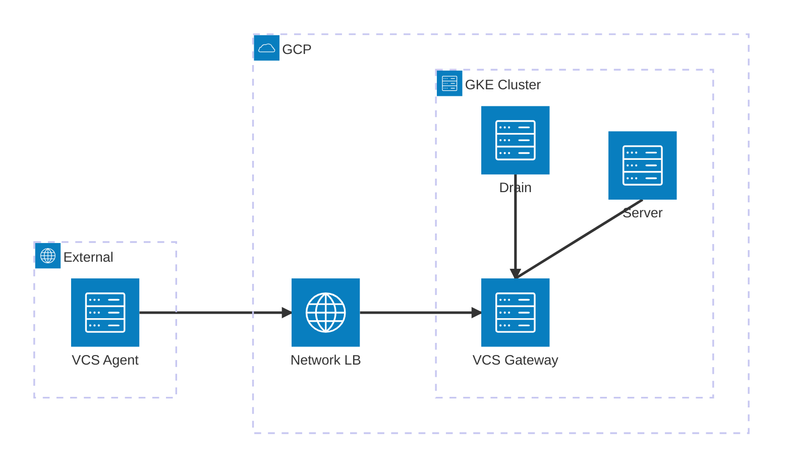

# With VCS Gateway Example

This example demonstrates how to deploy Spacelift Self-Hosted on GKE with the VCS Gateway enabled.

The VCS Gateway allows you to connect [remote VCS agents](https://docs.spacelift.io/concepts/vcs-agent-pools.html) to Spacelift, enabling integration with VCS providers that are not directly accessible from the Spacelift server.

## Architecture

The VCS Gateway service exposes two listeners:

- **gRPC (port 1984)** - External endpoint for [remote VCS Agents](https://docs.spacelift.io/concepts/vcs-agent-pools.html), exposed via a Network Load Balancer
- **HTTP (port 1985)** - Internal endpoint for Spacelift services (server, drain), accessed via Kubernetes service discovery



| Connection                    | Protocol | Port | Path                                                             |
| ----------------------------- | -------- | ---- | ---------------------------------------------------------------- |
| VCS Agent → NLB → VCS Gateway | gRPC     | 1984 | `vcs-gateway.example.com:443` (TLS terminated at service)        |
| Server → VCS Gateway          | HTTP     | 1985 | `http://spacelift-vcs-gateway:1985` (internal service discovery) |
| Drain → VCS Gateway           | HTTP     | 1985 | `http://spacelift-vcs-gateway:1985` (internal service discovery) |

## Prerequisites

- DNS configuration to point the VCS Gateway domain to the created load balancer IP addresses (available in module outputs)

## Usage

```hcl
module "spacelift" {
  source = "github.com/spacelift-io/terraform-google-spacelift-selfhosted"

  region         = "us-central1"
  project        = "my-gcp-project"
  website_domain = "spacelift.example.com"

  # VCS Gateway configuration
  vcs_gateway_domain = "vcs-gateway.example.com"
}
```

## Inputs

| Name               | Description                                      | Type   | Required |
| ------------------ | ------------------------------------------------ | ------ | -------- |
| region             | GCP region to deploy resources                   | string | yes      |
| project            | GCP project to deploy resources                  | string | yes      |
| server_domain      | The domain that Spacelift is being hosted on     | string | yes      |
| vcs_gateway_domain | The domain for the VCS Gateway external endpoint | string | yes      |

## Outputs

After applying, the module provides:

- `vcs_gateway_ipv4_address` - The IPv4 address to use for DNS configuration
- `vcs_gateway_ipv6_address` - The IPv6 address to use for DNS configuration (if dual-stack is enabled)

## Next Steps

After deploying the infrastructure:

1. Configure DNS to point your VCS Gateway domain to the load balancer IP addresses
2. [Create a VCS Agent Pool](https://docs.spacelift.io/self-hosted/latest/concepts/vcs-agent-pools.html#create-the-vcs-agent-pool) in the Spacelift UI
3. [Configure direct network access](https://docs.spacelift.io/self-hosted/latest/concepts/vcs-agent-pools.html#configure-direct-network-access) on your private workers using the `SPACELIFT_PRIVATEVCS_MAPPING_*` environment variables
