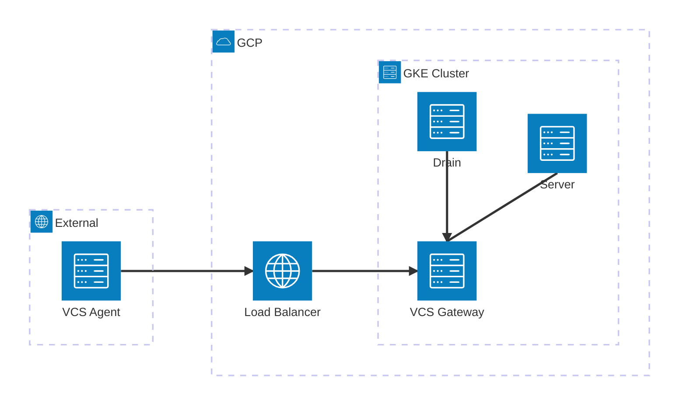

# With VCS Gateway Example

This example demonstrates how to deploy Spacelift Self-Hosted on GKE with the VCS Gateway enabled.

The VCS Gateway bridges Spacelift to [internally-hosted VCS systems](https://docs.spacelift.io/concepts/vcs-agent-pools.html) (e.g., GitHub Enterprise, GitLab, Bitbucket Data Center) that are not directly accessible from Spacelift.

## Architecture

The VCS Gateway service exposes two listeners:

- **gRPC (port 1984)** - External endpoint for [remote VCS Agents](https://docs.spacelift.io/concepts/vcs-agent-pools.html), exposed via [Global External Managed Load Balancer](https://docs.cloud.google.com/load-balancing/docs/https)
- **HTTP (port 1985)** - Internal endpoint for Spacelift services (server, drain), accessed via pod-to-pod networking within the GKE cluster to proxy requests to your private VCS system



| Connection                                                                | Protocol | Port | Path                                                 |
| ------------------------------------------------------------------------- | -------- | ---- | ---------------------------------------------------- |
| [VCS Agent](https://github.com/spacelift-io/vcs-agent) → LB → VCS Gateway | gRPC     | 1984 | `vcs-gateway.example.com:443` (TLS terminated at LB) |
| Server → VCS Gateway                                                      | HTTP     | 1985 | `http://<pod-ip>:1985` (direct pod IP)               |
| Drain → VCS Gateway                                                       | HTTP     | 1985 | `http://<pod-ip>:1985` (direct pod IP)               |

## Prerequisites

- DNS configuration to point the VCS Gateway domain to the created load balancer IP addresses (available in module outputs)

## Usage

```hcl
module "spacelift" {
  source = "github.com/spacelift-io/terraform-google-spacelift-selfhosted"

  region         = "us-central1"
  project        = "my-gcp-project"
  website_domain = "spacelift.example.com"

  # VCS Gateway configuration
  vcs_gateway_domain = "vcs-gateway.example.com"
}

output "vcs_gateway_healthcheck_manifest" {
  value = module.spacelift.vcs_gateway_healthcheck_manifest
}
```

## Inputs

| Name               | Description                                      | Type   | Required |
| ------------------ | ------------------------------------------------ | ------ | -------- |
| region             | GCP region to deploy resources                   | string | yes      |
| project            | GCP project to deploy resources                  | string | yes      |
| server_domain      | The domain that Spacelift is being hosted on     | string | yes      |
| vcs_gateway_domain | The domain for the VCS Gateway external endpoint | string | yes      |

## Outputs

After applying, the module provides:

- `vcs_gateway_address` - The IPv4 address for DNS configuration (alternatively, use `kubectl get gateway -n <namespace>`)
- `vcs_gateway_healthcheck_manifest` - A Kubernetes manifest for gRPC health checks (**required** - see below)

> [!NOTE]
> **Why Gateway API instead of Ingress?** GKE Ingress creates a Classic Application Load Balancer which does not support HTTP/2 cleartext (h2c) to backends. Since VCS Gateway uses gRPC (which requires HTTP/2), we use the Gateway API with `gke-l7-global-external-managed` which creates a Global External Application Load Balancer that properly supports h2c.

## Next Steps

After deploying the infrastructure:

1. Configure a DNS A record to point your VCS Gateway domain to the load balancer IP address:
   ```
   vcs-gateway.example.com  A  <vcs_gateway_address>
   ```
2. Deploy the Spacelift Helm chart
3. Apply the gRPC health check policy:
   ```bash
   terraform output -raw vcs_gateway_healthcheck_manifest > vcs-gateway-healthcheckpolicy.yaml
   kubectl apply -f vcs-gateway-healthcheckpolicy.yaml
   ```
   > [!IMPORTANT]
   > The default HTTP-based health check will fail for gRPC services. You must apply the `HealthCheckPolicy` manifest to configure gRPC health checks for the load balancer. Without this, the backend will be marked as unhealthy and the load balancer will return 502 errors.
4. [Create a VCS Agent Pool](https://docs.spacelift.io/self-hosted/latest/concepts/vcs-agent-pools.html#create-the-vcs-agent-pool) in the Spacelift UI
5. [Configure direct network access](https://docs.spacelift.io/self-hosted/latest/concepts/vcs-agent-pools.html#configure-direct-network-access) on your private workers using the `SPACELIFT_PRIVATEVCS_MAPPING_*` environment variables
